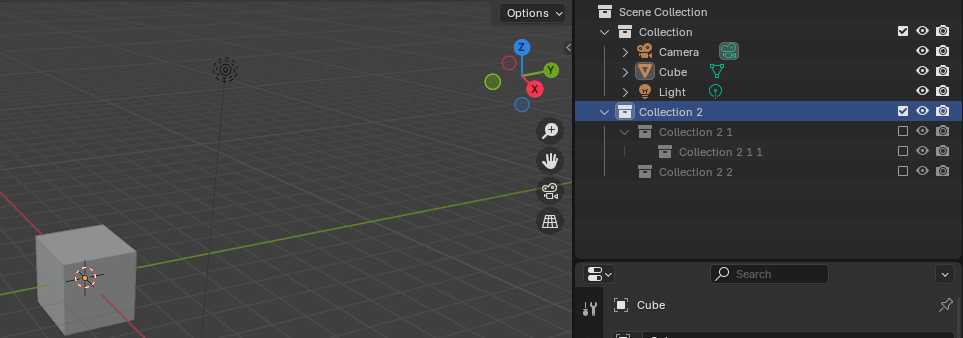
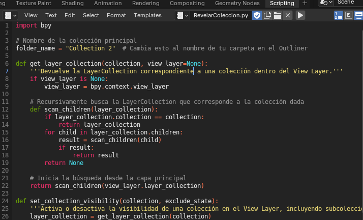
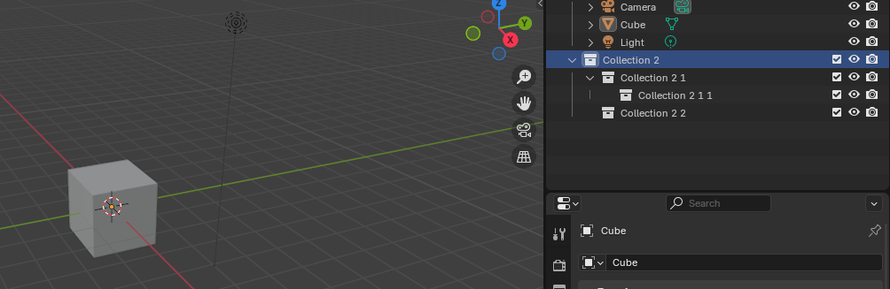

# Script para Activar una Colección y sus Subcolecciones en Blender
Este script en Python está diseñado para activar una colección específica y todas sus subcolecciones dentro del View Layer de Blender. Esto asegura que tanto la colección como sus elementos secundarios sean visibles y renderizables en la escena.

**¿Buscas activar las carpetas o colecciones de blender y todo su contenido desde modelos y subcolecciones?** 

## Características
Incluir Colección en el View Layer: Habilita la colección principal especificada, así como todas sus subcolecciones.
- Automatización: Evita la necesidad de activar manualmente las casillas de exclusión (exclude from view layer) en el Outliner.
- Recursividad: Garantiza que todas las colecciones hijas se activen junto con la colección principal.
## Uso del Script
### Requisitos previos:

Asegúrate de estar trabajando en Blender con soporte para Python habilitado.
Ten el nombre exacto de la colección principal que deseas activar.
### Instrucciones:

Copia y pega el script en el editor de texto de Blender (en la pestaña Scripting).
Modifica la variable folder_name con el nombre de la colección principal que deseas activar.
Ejecuta el script presionando el botón Run Script.
### Resultados esperados:

La colección principal y todas sus subcolecciones serán visibles en el View Layer.
Se desactivará la exclusión (exclude) de todas las colecciones afectadas.
## Detalles Técnicos
Propiedad Utilizada: El script modifica la propiedad exclude de los objetos LayerCollection en Blender.
LayerCollection.exclude = False: Activa la colección en el View Layer.
## Ventajas:
Evita errores manuales al activar múltiples colecciones.
Asegura que todas las colecciones hijas sean visibles y utilizables.

## Notas
Si la colección especificada no existe, el script mostrará un mensaje de error en la consola.  
Asegúrate de usar el nombre exacto de la colección en la variable folder_name.  
Para desactivar una colección y sus subcolecciones, cambia exclude_state=False por exclude_state=True.  
**####Cuidado si la coleccion tiene elementos pesados, muy complejos o que activarlos hagan que el programa se sobrecargare o crasherare######**
## Compatibilidad
Este script es compatible con Blender 2.8 y versiones posteriores, ya que utiliza la API moderna basada en View Layers.

## Propósito del Script
Este script es ideal para proyectos grandes donde se utilizan muchas colecciones y es necesario alternar rápidamente su visibilidad en el View Layer sin hacerlo manualmente desde el Outliner.

## IMAGENES
  
Ejemplo de colecciones desactivadas.   
  
Ejecucion del script.   
  
Ejemplo activado.  

Blender - Colecciones - View Layer - activacion - exclude